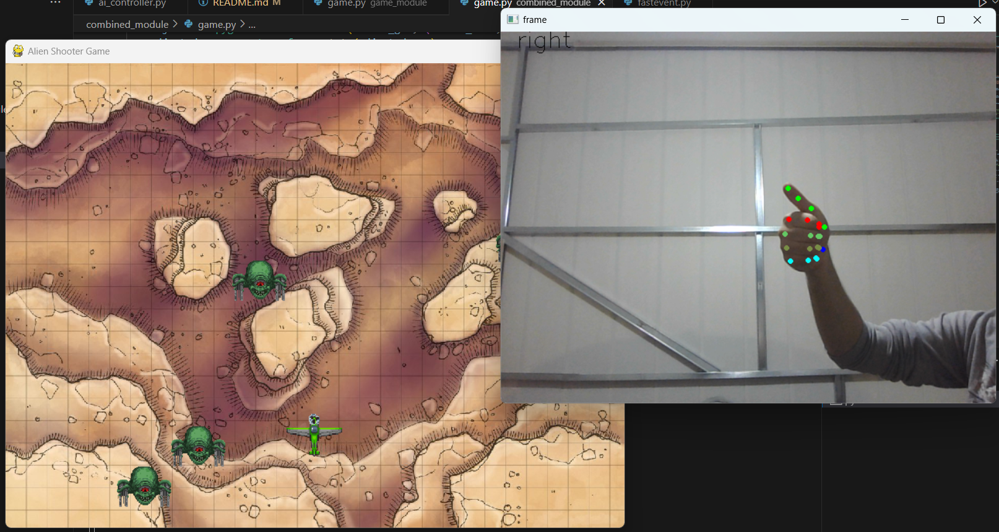

## Alian Shooter With Hand Gestures
A python pygame based game that can be controlled through hand gestures. The game is controlled by move your index with a grib. Left and right. A full grib where the index is touching the hand is a shoot.

### Installation 
* Clone the repository
* Create a new virtual enviroment `python -m venv .myenv`
* Activate the enviroment `./myenv/Scripts/activate`
* Download requirments `python -m pip install -r requirments.txt`

### Modules

* **game_module**: The traditional vanilia game. Just a simple alian shooter game with three inputes left, right and shoot. No AI associated with it.

* **ai_module**: The ai module that reades camera frames and detect hand gestures and the movement of the index. No game associated with it.

* **combined_module**: The game that runs by hand gestures. It is actually the combination and the attachment of the above two modules.

### Libraries
The game is based on PyGame modeule. The AI hand landmarker is based on Google's Mediapipe Hand Landmarker.

